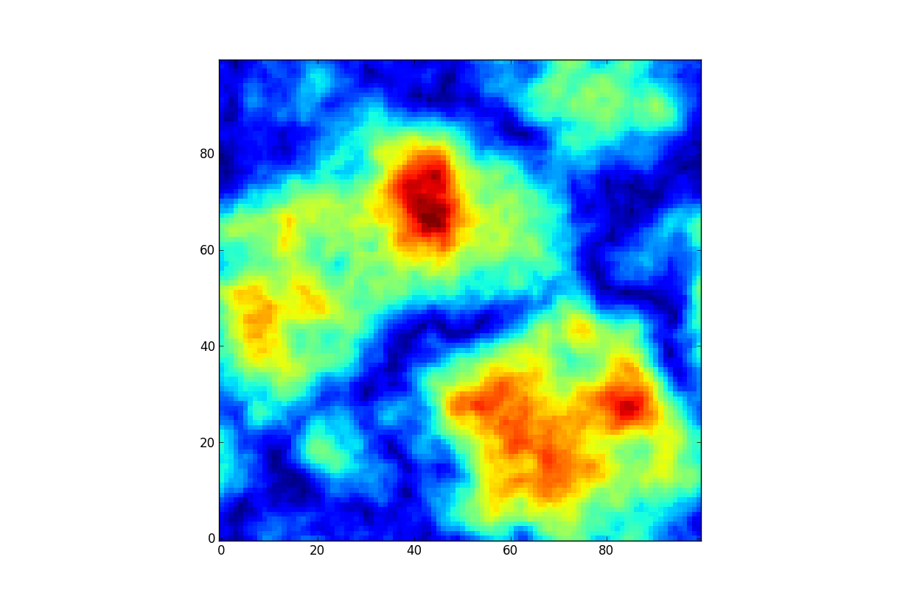
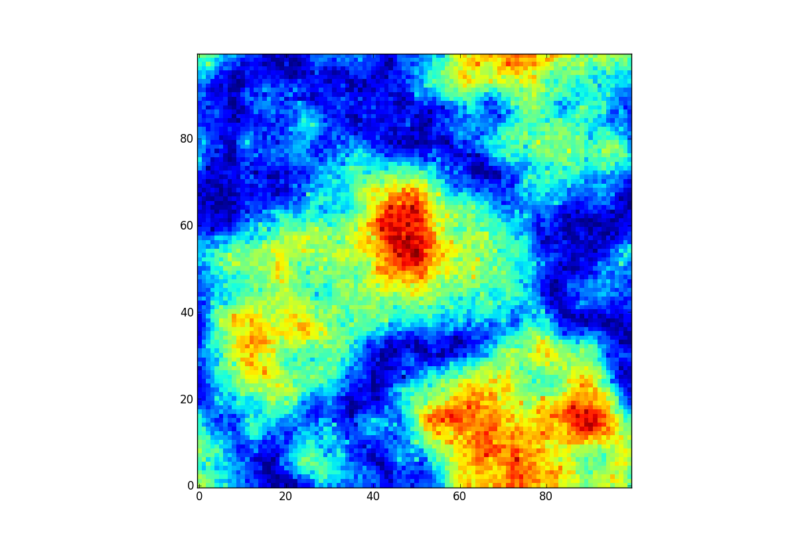

.. image_registration documentation master file, created by
   sphinx-quickstart on Mon Sep  3 08:57:59 2012.
   You can adapt this file completely to your liking, but it should at least
   contain the root `toctree` directive.

(Astronomical) Image Registration
=================================

`Github: Image Registration <https://github.com/keflavich/image_registration>`_

.. admonition:: TL;DR version

    Use :obj:`~image_registration.chi2_shifts.chi2_shift` to match images.

A toolkit for registering images of astronomical images containing primarily
extended flux (e.g., nebulae, radio and millimeter maps). [*]_

There are related packages scattered throughout the internet that do the same
thing, but with different features.

The general goal is to align images that look kind of like these:

Quick Example
-------------

Given two images, shift the second to match the first and check that they are
the same.  `This notebook
<https://github.com/keflavich/image_registration/blob/master/examples/Cross%20Correlation.ipynb>`__
also shows examples.

.. code-block:: python

   from image_registration import chi2_shift
   from image_registration.fft_tools import shift
   xoff, yoff, exoff, eyoff = chi2_shift(image, offset_image, noise,
   ...                                   return_error=True, upsample_factor='auto')
   corrected_image2 = shift.shiftnd(offset_image, (-yoff, -xoff))

Module APIs:
------------

   :doc:`image_registration`

   :doc:`image_registration.fft_tools` (and a description of the :doc:`fourier_tools`)

   The most successful of the methods implemented here is
   :obj:`~image_registration.chi2_shifts.chi2_shift`

   There is an ipython notebook demonstration of the code `here
   <http://nbviewer.ipython.org/urls/raw.github.com/keflavich/image_registration/master/examples/Cross%2520Correlation.ipynb>`__
   and in pdf `here
   <https://github.com/keflavich/image_registration/blob/master/doc/CrossCorrelationSimulation.pdf?raw=true>`__

Related Methods
---------------
There are many other approaches to performing image registration.  Some are
summarized here.  Note that this package is intended for image registration
where the brightness is "extended" or "spread out" - stellar images are best to
register by treating the stars as control points.

The methods below have various advantages and deficiencies.  The most dangerous
approach that should be avoided is that of fitting a gaussian to the peak of a
cross-correlation image: this is the only other method that allows for
measurements of the errors on the best-fit shift, but it is likely to be
systematically wrong.  The peak-fitting approach is unstable to fitting
cross-correlated structure (which may be "beam-shaped") instead of the
cross-correlation shift peak (which may have effectively no shape because it is
sub-pixel).

The main advantage of the `~image_registration.chi2_shifts.chi2_shift`
approach is that it can return *statistical errors* on the best-fit shift.
It is also fast and efficient for many image types and sizes.

Programs implementing these methods in various languages:
~~~~~~~~~~~~~~~~~~~~~~~~~~~~~~~~~~~~~~~~~~~~~~~~~~~~~~~~~

    `Varosi + Landsman astrolib correl_optimize <http://idlastro.gsfc.nasa.gov/ftp/pro/image/correl_optimize.pro>`_ :
        Uses cross-correlation with "reduction" and "magnification" factors for
        speed and accuracy respectively; this method is relatively slow when
        using the complete information in the image (the magnification process
        increases the size of the image directly)

    `Brian Welsch's cross-cor taylor <http://solarmuri.ssl.berkeley.edu/~welsch/public/software/cross_cor_taylor.pro>`_ :
        Uses the cross-correlation peak to measure the pixel peak of the
        offset, then does a 2nd order taylor-expansion around that peak to
        achieve sub-pixel accuracy.  Is fast and generally quite accurate, but
        can be subject to bias.

    `Manuel Guizar's Efficient Sub-Pixel Registration <http://www.mathworks.com/matlabcentral/fileexchange/18401-efficient-subpixel-image-registration-by-cross-correlation>`_ :
        A matlab version of the main method implemented in this code.  Is fast
        and accurate.  The speed comes from making use of the fourier zoom /
        fourier scaling property.

    `Marshall Perrin's sub-pixel image registration <http://www.stsci.edu/~mperrin/software/sources/subreg.pro>`_ :
        Implements many cross-correlation based methods, with sub-pixel
        registration based off of centroiding,  gaussian fitting, and many
        variations thereupon.  The gaussian approach is also implemented here,
        but is highly biased and inaccurate in general.  As a sidenote, I tried
        using the "gaussian fit after high-pass filter" approach, but found
        that it really didn't work - it helped remove SOME of the large-scale
        junk, but it didn't end up changing the shape of the peak in a helpful
        way.

    `Christoph Gohlke's python fft image registration code <http://www.lfd.uci.edu/~gohlke/code/imreg.py.html>`_ :
        Allows for rescaling and rotation.

    Related bibliographic items (with no attached code):
    `"Sub-pixel image registration with a maximum likelihood estimator" <http://adsabs.harvard.edu/abs/2005A&A...443..357G>`_
    The method they describe is statistically equivalent to what I have implemented, though my method measures the *error*
    on the maximum-likelihood offset in addition to the ML offset.

.. :mod:`image_registration` Module
.. --------------------------------

.. automodule:: image_registration
    :members:
    :undoc-members:

.. :mod:`image_registration.fft_tools` Module
.. ------------------------------------------

.. automodule:: image_registration.fft_tools
    :members:
    :undoc-members:

.. Contents:
.. ~~~~~~~~~

.. toctree::
   :maxdepth: 2

Indices and tables
==================

* :ref:`genindex`
* :ref:`modindex`
* :ref:`search`
* :doc:`image_registration.FITS_tools`
* :doc:`image_registration.fft_tools`
* :doc:`image_registration`

.. toctree::
  :maxdepth: 1

  spectral_xcorr.rst
  fourier_tools.rst
  image_registration.rst

.. [*] Apparently astronomical images look a lot like microscopic images.  So
  maybe this code is good for coaligning bacteria!

